# VMware–AWS 재해복구 아키텍처

> AWS Elastic Disaster Recovery를 활용한 VMware vSphere 기반 Multi-AZ DR 설계 및 구현

온프레미스 VMware VM을 AWS로 복제하고, 장애 발생 시 EC2로 복구하는 하이브리드 클라우드 재해복구 프로젝트입니다. 서버 복구 이후에도 애플리케이션이 통신할 수 있도록 **서버 간 연결을 DNS 기반으로 구성**하고, 복구된 서비스와 데이터 보존 여부를 확인했습니다.

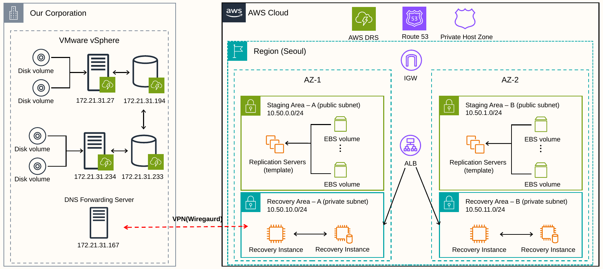

| 항목 | 내용 |
| --- | --- |
| 발표 | 우리 FISA 2차 기술세미나 |
| 발표자 | 박성준 |
| 자료 기준 | 2026년 4월 |
| 원본 환경 | VMware vSphere 기반 온프레미스 |
| 복구 환경 | AWS 서울 리전, 2개 가용 영역 |
| 핵심 기술 | AWS DRS, EC2, EBS, Route 53 Private Hosted Zone, DNS Forwarding, WireGuard, ALB |

## 목차

- [프로젝트 배경과 목표](#프로젝트-배경과-목표)
- [기술 스택](#기술-스택)
- [아키텍처 구성](#아키텍처-구성)
- [복제와 복구 흐름](#복제와-복구-흐름)
- [DNS 기반 서비스 연결](#dns-기반-서비스-연결)
- [시연 및 검증 결과](#시연-및-검증-결과)
- [복구 후 작업](#복구-후-작업)
- [핵심 정리와 개선 과제](#핵심-정리와-개선-과제)

## 프로젝트 배경과 목표

온프레미스 환경에서 서비스가 중단되었을 때 AWS를 복구 환경으로 활용할 수 있는지 확인하고, 실제 서비스가 다시 동작하기까지 필요한 구성을 설계했습니다.

- VMware VM의 데이터를 AWS에 복제하고 EC2로 복구합니다.
- 복구 영역을 두 가용 영역으로 나누어 구성합니다.
- 환경 전환으로 IP가 달라져도 도메인 네임으로 서버에 접근하도록 구성합니다.
- 복구된 환경에서 서비스 응답과 기존 데이터 보존 여부를 확인합니다.
- 복구 작업 로그와 복구 지점을 확인해 복구 시간 및 데이터 손실 범위를 검토합니다.

### HA와 DR

| 구분 | HA · 고가용성 | DR · 재해복구 |
| --- | --- | --- |
| 목적 | 구성요소 장애에 따른 서비스 중단 최소화 | 재해 발생 후 서비스 복구 |
| 주요 방식 | 이중화, 장애 전환, 로드 밸런싱 | 데이터 복제, 백업, 복구 환경 기동 |
| 주요 관점 | 가동률과 다운타임 | 복구 시간과 데이터 손실 범위 |

이 프로젝트는 평상시 데이터를 복제하고 장애 시 복구 서버를 기동하는 구성을 중심으로 진행했습니다.

## 기술 스택

| 영역 | 기술 | 활용 |
| --- | --- | --- |
| 온프레미스 | VMware vSphere | 원본 VM 운영 |
| 데이터 복제 | AWS DRS, AWS Replication Agent | 원본 서버 등록 및 디스크 데이터 복제 |
| 복구 인프라 | EC2, EBS | 복구 인스턴스와 볼륨 구성 |
| 네트워크 | VPC, Public / Private Subnet | Staging Area와 Recovery Area 분리 |
| 하이브리드 연결 | WireGuard | 온프레미스와 AWS 간 통신 |
| 도메인 네임 해석 | Route 53 Private Hosted Zone, DNS Forwarding Server | 내부 도메인 네임과 서버 주소 연결 |
| 서비스 진입 | ALB | 복구 서버로 요청 전달 |
| 복구 후 작업 | DRS Post-launch actions, AWS Systems Manager | SSM 활성화, 볼륨 검증, AMI 생성 결과 확인 |

## 아키텍처 구성

온프레미스의 원본 서버 데이터를 AWS의 Staging Area에 복제하고, 복구 시 각 가용 영역의 Private Subnet에 Recovery Instance를 기동하는 구조입니다.

| 영역 | AZ-1 | AZ-2 | 역할 |
| --- | --- | --- | --- |
| Staging Area · Public Subnet | `10.50.0.0/24` | `10.50.1.0/24` | 복제 서버 및 복제 데이터 유지 |
| Recovery Area · Private Subnet | `10.50.10.0/24` | `10.50.11.0/24` | 복구 인스턴스 실행 |

온프레미스에는 DNS Forwarding Server(`172.21.31.167`)를 두고, WireGuard를 통해 AWS 측 내부 이름 해석과 연결하도록 구성했습니다. ALB는 복구 영역의 서버로 서비스 요청을 전달하는 구성입니다.

## 복제와 복구 흐름

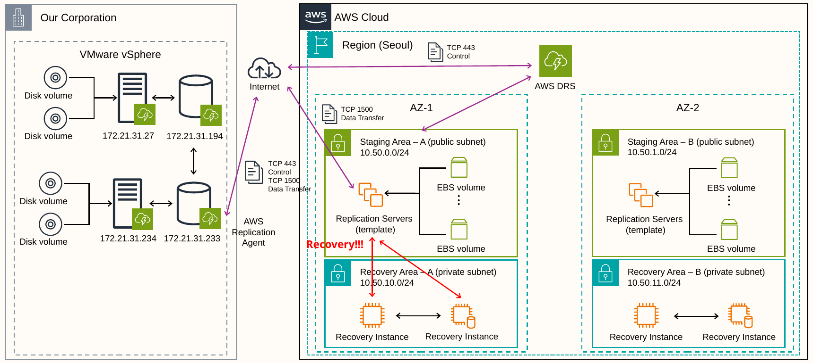

1. 온프레미스 원본 서버에 AWS Replication Agent를 설치합니다.
2. AWS DRS 콘솔에 원본 서버가 등록되고 초기 데이터 복제가 진행됩니다.
3. Staging Area의 복제 서버와 EBS 볼륨에 복제 데이터를 유지합니다.
4. 복구 작업을 시작하면 복제 데이터를 바탕으로 EC2 Recovery Instance를 기동합니다.
5. 복구 환경에 맞는 DNS 응답과 서비스 연결을 확인합니다.
6. 서비스 응답, 데이터 보존 여부, 복구 후 작업 결과를 검증합니다.

통신 구성은 제어 트래픽에 `TCP 443`, 데이터 전송에 `TCP 1500`을 사용합니다.

## DNS 기반 서비스 연결

### 해결하려던 문제

원본 서버의 IP를 직접 참조하는 설정은 AWS 복구 후 변경된 서버 주소를 반영하지 못합니다. 따라서 서버가 정상적으로 기동하더라도 애플리케이션의 서버 간 연결이 끊길 수 있습니다.

이를 해결하기 위해 내부 도메인 네임을 사용하고, 정상 상태와 복구 상태에 맞는 서버 주소를 DNS로 해석하는 구조를 구성했습니다.

### 정상 상태

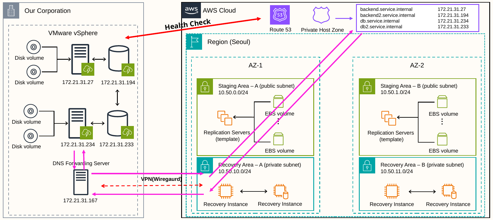

정상 상태에서는 내부 도메인 네임이 온프레미스 서버 주소를 가리킵니다. 온프레미스의 DNS Forwarding Server와 AWS Private Hosted Zone을 연계하는 구성을 사용했습니다.

### 복구 상태

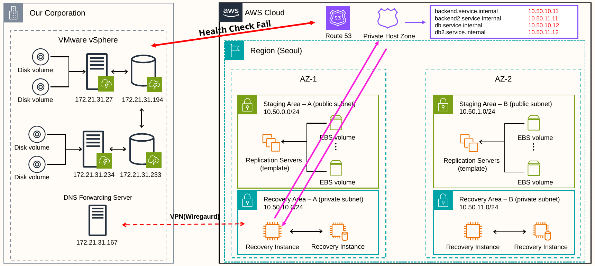

복구 상태에서는 동일한 도메인 네임이 AWS Recovery Instance 주소를 가리키도록 구성했습니다.

| 도메인 네임 | 정상 상태 · 온프레미스 | 복구 상태 · AWS |
| --- | --- | --- |
| `backend.service.internal` | `172.21.31.27` | `10.50.10.11` |
| `backend2.service.internal` | `172.21.31.194` | `10.50.11.11` |
| `db.service.internal` | `172.21.31.234` | `10.50.10.12` |
| `db2.service.internal` | `172.21.31.233` | `10.50.11.12` |

서비스 설정에서는 동일한 이름을 유지하면서 DNS가 환경에 맞는 주소를 반환하도록 설계했습니다.

## 시연 및 검증 결과

### 1. 원본 서버 등록 및 복제 완료

Agent 설치 직후 원본 서버가 AWS DRS에 등록되는 상태와 데이터 복제가 완료된 상태를 확인했습니다.

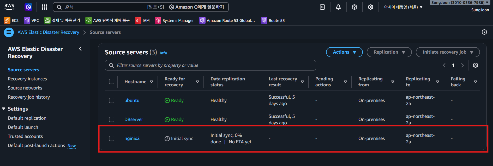

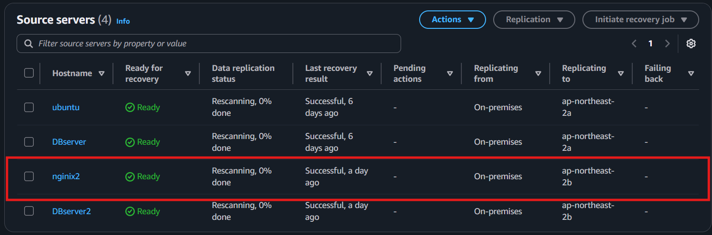

### 2. 복구 전후 서비스 동작과 데이터 확인

복구 전후 서비스 화면과 DB 조회 결과를 비교해 기존 데이터가 보존되고 서비스가 응답하는지 확인했습니다.

| 복구 전 | 복구 후 |
| --- | --- |
| 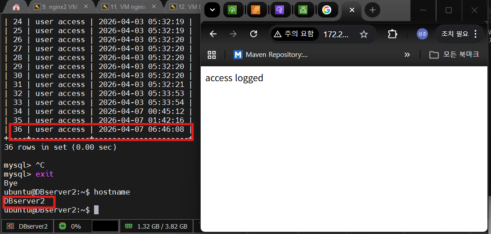 | 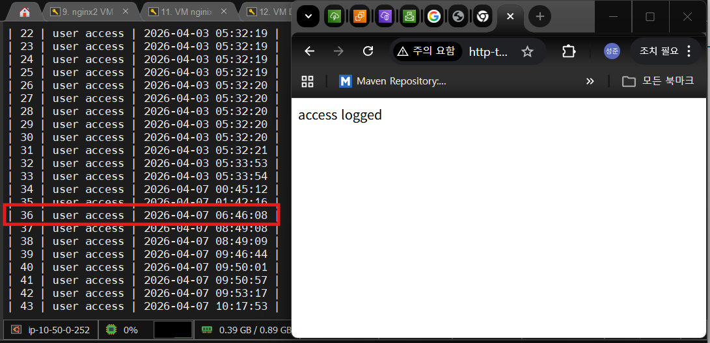 |

### 3. 복구 시간과 복구 지점

| 지표 | 발표 자료의 값 | 확인 근거 |
| --- | --- | --- |
| RTO | 약 12분 | DRS 복구 작업 시작부터 작업 종료까지의 로그 |
| RPO | 10~15분 | 발표 자료에 제시한 스냅샷 복구 지점 간격 |

복구 작업은 `2026-04-07 17:00:38`에 시작해 `17:13:11`에 종료되었습니다. 로그 기준 경과 시간은 **12분 33초**입니다.

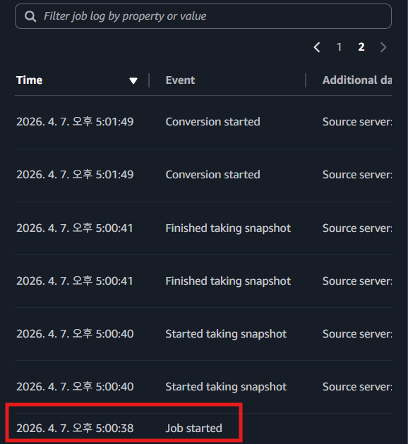

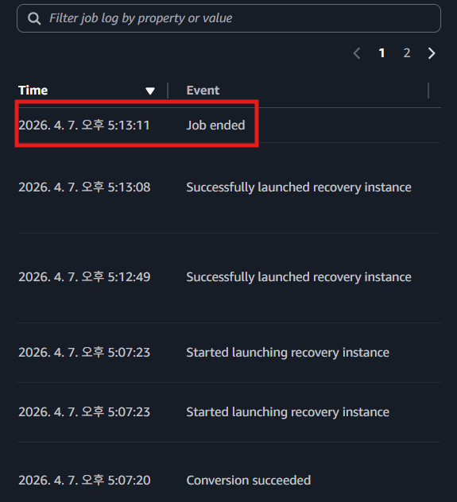

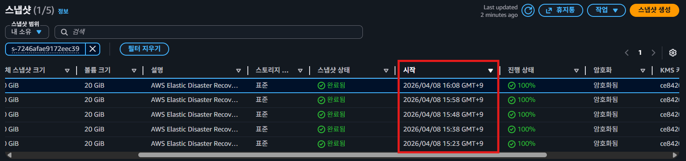

## 복구 후 작업

AWS DRS의 Post-launch actions 설정과 실행 결과를 확인했습니다.

Post-launch 설정과 실행 결과 보기

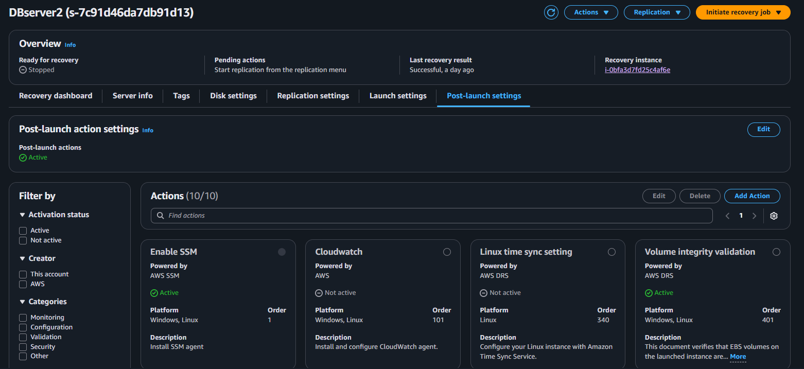

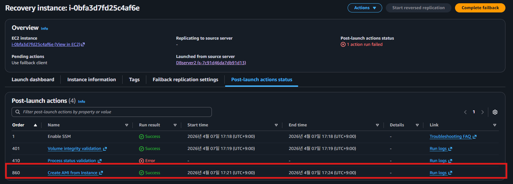

| 작업 | 화면에서 확인한 결과 |
| --- | --- |
| Enable SSM | Success |
| Volume integrity validation | Success |
| Process status validation | Error |
| Create AMI from Instance | Success |

프로세스 상태 검증은 오류로 표시되어 있으며, 원인과 해결 결과는 발표 자료에 포함되어 있지 않습니다. AMI 생성 성공과 각 검증 작업의 결과를 구분해 확인했습니다.

## 핵심 정리와 개선 과제

### 프로젝트에서 확인한 점

- VMware 원본 서버를 AWS DRS에 등록하고 복제한 후 EC2로 복구하는 흐름을 확인했습니다.
- 도메인 네임을 통한 연결로 온프레미스와 AWS의 주소 차이를 처리하는 구조를 설계했습니다.
- 복구된 서버에서 서비스 응답과 기존 데이터 보존 여부를 확인했습니다.
- 복구 작업 로그와 Post-launch 결과를 통해 서버 기동 이후의 검증 필요성을 확인했습니다.

### 추가 검증 및 개선 방향

아래 항목은 후속 개선 과제이며, 이번 자료에서 구현 또는 검증을 완료한 결과는 아닙니다.

- 서비스 응답 정상화까지 포함한 종단 간 RTO 측정
- 마지막 반영 데이터의 시각을 기준으로 한 실제 RPO 측정
- DNS 전환 자동화와 캐시·TTL 영향 검증
- 온프레미스 전체 장애 시 DNS Forwarding Server 및 VPN 경로의 가용성 검증
- Process status validation 오류 원인 분석
- 온프레미스로의 Failback 절차 및 데이터 정합성 검증

---
